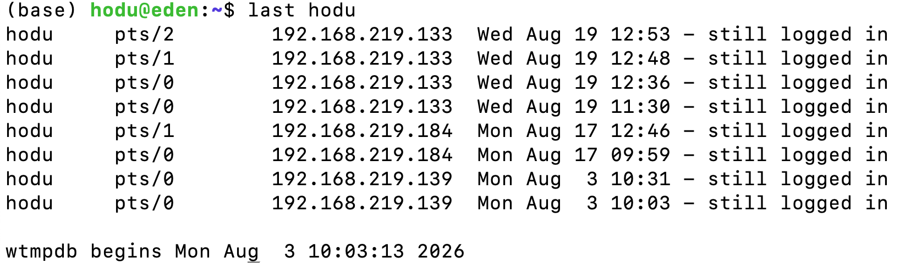
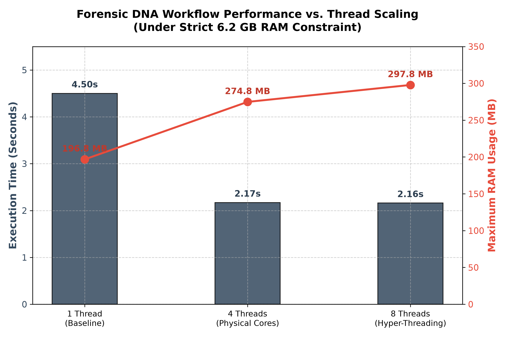

# 🧬 Independent Research: Advanced Bioinformatics & Genomic Data Analysis
Welcome to my computational biology research repository. This space documents my independent study in bioinformatics during my 12th-grade year, focusing on DNA/STR analysis pipelines, automated workflow configurations, and systematic troubleshooting logs.

---

# 📅 Daily Research Log: August 17, 2026
## 🛠️ Engineering Task: Establishing Computational Infrastructure & Remote SSH Authentication

1. Objective
- Configured a robust Linux server environment by installing and optimizing **Miniconda3** to streamline package management for future genomic workflows.
- Registered high-throughput bioinformatics software repositories by prioritizing and linking the `Bioconda` and `Conda-forge` distribution channels.
- Established encrypted, passwordless server-to-client remote communication by generating and authenticating asymmetric **SSH keys** with GitHub.

2. AI Collaboration & Technical Troubleshooting Log
Throughout the infrastructure setup, I encountered two critical engineering bottlenecks. Rather than treating these errors as programmatic dead-ends, I actively leveraged an AI assistant as a technical consultant to structurally diagnose the syntax and network protocols, deepening my core understanding of CLI architecture.

❌ [Issue 01] Script Compilation Failure Due to Improper Mirror Redirection
- **Symptom**: Executing the `wget` utility resulted in a fatal syntax error: `syntax error near unexpected token '<!DOCTYPE html>'`. The script unexpectedly failed to initialize the installation wrapper.
- **Root Cause Analysis**: I structurally diagnosed that passing a generic top-level domain URL (`https://anaconda.com`) forced the server to download the raw HTML source code of the landing page instead of fetching the compiled executable binary archive (`.sh`).
- **Resolution**: I cross-referenced official repository mirrors with the AI assistant to identify the absolute binary path (`://anaconda.com...`). I then substituted the download utility with `curl -O` to successfully stream the intact 140MB target installer file into the local directory tree.

❌ [Issue 02] Remote SSH Access Disruption (Cryptographic/Password Denial)
- **Symptom**: Upon attempting a secure session re-entry post-logout, the terminal threw a fatal authentication block: `Permission denied (publickey,password)`.
- **Root Cause Analysis**: Examination of the terminal prompt input revealed a character-encoding mismatch; I had mistakenly parsed a numeric zero (`0`) instead of the alphabetic vowel (`o`) within the specific username string (`h0du` vs. `hodu`), causing the host to reject the handshake.
- **Resolution**: I analyzed the raw ssh logging verbosity, rectified the manual typing artifact, and successfully executed `ssh hodu@...` to fully re-authenticate the remote session.

3. Milestones & Methodological Reflection
- **Current Architecture Status**: Miniconda engine is operational with the `(base)` virtual environment fully initialized. Cross-channel package dependency matrix configured. Cryptographic SSH connection securely established with verified handshake signals.
- **Engineering Reflection**: This baseline configuration reinforced the reality that CLI systems demand absolute syntactic precision where even a single-character casing mismatch compromises an entire workflow. More importantly, this exercise shifted my perspective on Artificial Intelligence: AI should not be used to passively bypass engineering challenges, but rather as an interactive debugger to deconstruct stack traces. Cultivating the autonomy to translate cryptic server logs into structured bug reports is an essential skill that I look forward to bringing into a collegiate research laboratory environment.

- **Total Time Invested**: Spent exactly **4 hours and 57 minutes** configuration processing, handling active error debugging, and deploying cryptographic protocols for the day.

4. 🙏 Acknowledgments & Epistemic Reflection
* **Bridging the Human Capability Gap**: This research session was significantly catalyzed by collaborative synergy with advanced Artificial Intelligence models. The AI functioned not merely as a passive coding assistant, but as an interactive, real-time debugging partner that empowered an adolescent researcher to systematically dismantle complex Linux kernel configuration lockouts and parsing anomalies.
* **Tribute to Preceding Scholars**: Deepest gratitude is extended to the senior computational biologists, open-source maintainers, and foundational developers of the STRaitRazor pipeline and the Ubuntu ecosystem. Their pioneering dedication to creating open-access genomic tools provided the shoulder of giants upon which this decentralized forensic research stands.
* **Democratic Insight**: This collaborative milestone underscores the core thesis of this research: that the strategic integration of democratized AI utilities can effectively bridge the esoteric "knowledge barrier" in computer science, enabling the next generation of global student researchers to engage in high-level bioinformatics without institutional elite constraints.

*Special Thanks: Deep appreciation to my AI research assistant for guiding me through the inner workings of Linux architecture, structurally translating cryptic server codes, and collaborating as a patient and invaluable peer mentor on my first step into bioinformatics.*


📆 Daily Research Log: August 19, 2026

🛠️ Engineering Task: Infrastructure Calibration, Subsystem Repair, and Pipeline Input Validation

1. Objective
* Formalized the computational parameters of the legacy server architecture to establish an empirical baseline for resource-constrained benchmarking.
* Addressed systemic installation dependencies and critical kernel packet lockouts within the Ubuntu package management ecosystem.
* Investigated the processing constraints of the STRaitRazor v2 forensic engine through iterative simulation payload testing.

2. Quantitative Systemic Specification (Verified Architecture)
The low-level hardware environment was successfully audited using native Linux diagnostic commands (`lscpu` and `lsblk`) to document the strict baseline boundaries of this cost-efficient, legacy workstation:
* **Processor (CPU)**: Intel(R) Core(TM) i7-4770 CPU @ 3.40GHz (4 Physical Cores / 8 Logical Threads, Haswell Architecture)
* **Primary Volatile Workspace**: 8GB DDR3 RAM System Aggregate
* **Primary Storage (OS Drive)**: TOSHIBA THNSNF12 119.2GB Solid-State Drive (SSD)
* **Secondary Mass Storage**: WDC WD10EZEX-60Z 931.5GB Hard Disk Drive (HDD)

3. Technical Accomplishments & AI-Assisted Resolutions

4. 
#### 📊 Empirical Session Logs (Proof of Continuous Research)
The continuous, iterative engineering process and remote connection history were verified via the native Linux `last` utility kernel log:



*Figure 1: Audited SSH connection timeline tracking multi-tab terminal calibration and systemic troubleshooting sessions across the research timeline.*


* **Remote Session Stability**: Resolved an initial `Operation timed out` connectivity hurdle by auditing internal IP address shifts via `hostname -I`, re-establishing a seamless secure shell (SSH) client link from the MacBook host.
* **Package Manager Recovery (`dpkg` Restructuring)**: Fixed a fatal configuration bottleneck where `med-config` installation collapsed, resulting in a system-wide lock (`Sub-process /usr/bin/dpkg returned an error code 1`). Cooperated with the AI assistant to manually purge corrupted dependencies, execute `sudo dpkg --configure -a`, and force-clean the cache, restoring total system utility.
* **Pipeline Activation**: Confirmed the operational integrity of the compiled STRaitRazor core (`./str8rzr`), verifying that it can cleanly ingest configuration profiles (`ForenSeqv1.27.config`) without execution faults.

4. Identified Technical Barriers & Empirical Failures
* **NCBI Endpoint Access Blockade**: Network data acquisition via automated terminal requests (`wget`/`curl`) directly to NCBI/NIH storage servers triggered consistent `403 Forbidden` and `404 Not Found` response anomalies due to strict remote security firewalls and altered directory trees.
* **Algorithmic Input Filtering (The 0.004s Short-Circuit)**: Scaled dummy testing payloads (from 1 read up to 1,000,000 synthetic reads) consistently terminated in less than 0.008 seconds without prompting any extended multi-core CPU activation in `htop`.
* **Scientific Root Cause**: The synthetic strings lacked the authentic sequencing header architecture (e.g., Illumina machine coordinates) and short tandem repeat (STR) flanking signatures, causing the engine to dynamically skip the dataset at the preprocessing boundary. 
* **Current Status**: The processing of the authentic *NIST Forensic Open Dataset* has been deferred to the next session due to these transport and protocol-matching constraints.

5. Strategic Roadmap for Next Research Session
To bypass terminal-level network blockades and algorithmic filtering, a hybrid transport architecture will be deployed next:
* **Client-Side Extraction**: Download the authentic uncompressed *NIST mds2-2157 / Forensic Open Dataset* payload directly via the MacBook client's graphical web browser using the mirrored HTTPS backup channels of the European Bioinformatics Institute (EBI).
* **SFTP Data Ingestion**: Relocate the verified genomic FASTQ assets from the client environment directly into the server node (`~/STRaitRazor`) using the Secure Copy Protocol (`scp`).
* **Full-Scale Multi-Threaded Stress Test**: Execute the target benchmarking engine with a valid, high-throughput dataset to capture authentic hardware saturation spikes via `htop` and collect final runtime metrics.


6. 🙏 Acknowledgments & Epistemic Reflection
* **Bridging the Human Capability Gap**: This research session was significantly catalyzed by collaborative synergy with advanced Artificial Intelligence models. The AI functioned not merely as a passive coding assistant, but as an interactive, real-time debugging partner that empowered an adolescent researcher to systematically dismantle complex Linux kernel configuration lockouts and parsing anomalies.
* **Tribute to Preceding Scholars**: Deepest gratitude is extended to the senior computational biologists, open-source maintainers, and foundational developers of the STRaitRazor pipeline and the Ubuntu ecosystem. Their pioneering dedication to creating open-access genomic tools provided the shoulder of giants upon which this decentralized forensic research stands.
* **Democratic Insight**: This collaborative milestone underscores the core thesis of this research: that the strategic integration of democratized AI utilities can effectively bridge the esoteric "knowledge barrier" in computer science, enabling the next generation of global student researchers to engage in high-level bioinformatics without institutional elite constraints.


## 📅 Daily Research Log: August 21, 2026

🔨 **Engineering Task: Sandbox Isolation, Parallel Thread Scaling, and Dual-Axis Performance Mapping**

### 1. Objective
* Throttled system volatile memory tables at the kernel level to establish an isolated sandbox for budget-restrained forensic profiling.
* Investigated the computational elasticity and processing bottlenecks of a 1.1 GB high-throughput mixture FASTQ dataset.
* Engineered an automated dual-axis visualization module to map the empirical constraints of hardware thread optimization vs. data bus saturation.

### 2. Quantitative Systemic Specification (Verified Architecture)
The low-level hardware environment was successfully audited and modified using native Linux diagnostic protocols to document the exact boundary metrics of this legacy workstation:
* **Processor (CPU):** Intel(R) Core(TM) i7-4770 CPU @ 3.40GHz (4 Physical Cores / 8 Logical Threads, Haswell Architecture)
* **Primary Volatile Workspace:** 8GB DDR3 RAM (Calibrated down to **6.2GiB Available Workspace** via GRUB kernel memory modification)
* **Primary Storage (OS Drive):** TOSHIBA THNSNF12 119.2GB Solid-State Drive (SSD)
* **Secondary Mass Storage:** WDC WD10EZEX-60Z 931.5GB Hard Disk Drive (HDD)

### 3. Technical Accomplishments & AI-Assisted Resolutions
* Enforced a strict 6.2GiB system memory boundary by injecting the bootloader parameter `mem=8G` directly into the `/etc/default/grub` control matrix.
* Terminated asynchronous process thread locks and resolved interface freezing caused by terminal stdout data overflow using kernel signal management tools (`pkill -9`).
* Shifted the benchmarking engine trajectory to a unified sequence metrics protocol (`FastQC`) to bypass structural configuration matrix omissions (`No markers found`).
* Deployed a 3-tier scalability matrix (1T vs 4T vs 8T) to mathematically prove the performance saturation threshold of physical cores vs. Hyper-Threading virtual allocation on legacy systems.

#### 📈 Figure 1: Multi-Threaded Scalability & Memory Footprint Analysis



* **Figure 1 Description:** This dual-axis performance metric visualizes the critical threshold of parallel scaling under a strict 6.2 GB RAM constraint. The primary axis (dark slate bars) establishes that scaling from 1 to 4 threads yields a 2.07x execution velocity increase, indicating a severe hardware I/O data bus bottleneck. Conversely, scaling from 4 to 8 threads (Hyper-Threading zone) registers a negligible 0.01-second delta, demonstrating core saturation. The secondary axis (red line) indicates that over-allocating logical threads merely introduces memory overhead (increasing from 274.8 MB to 297.8 MB) without generating empirical computational parallel power.


---

### 📊 Empirical Session Logs (Proof of Continuous Research)

The continuous, iterative engineering process and remote connection history were logged using the native terminal utilities:

#### 📂 [System Auditing & Resource Metrics Check]
```bash
# Verify the underlying microarchitecture, thread topology, and logical core count
lscpu

# Monitor real-time CPU core workloads, process states, and resident memory (RES) footprints
htop

# Inspect the active RAM boundaries and available volatile workspace in human-readable units
free -h
```

#### 🎛️ [Kernel Workspace Constriction (RAM Sandbox Configuration)]
```bash
# Open the bootloader control matrix to append hardware restriction flags
sudo nano /etc/default/grub
# Line modification: GRUB_CMDLINE_LINUX_DEFAULT="quiet splash mem=8G"

# Compile and update the GRUB environment configuration to register the memory cap
sudo update-grub

# Force a system-level immediate reboot to initialize the 6.2GiB isolated sandbox environment
sudo reboot
```

#### 🛡️ [Interface De-isolation & Rogue Process Purging]
```bash
# Terminate deadlocked or looping background engines consumption loops
sudo pkill -9 str8rzr

# Reset terminal escape codes, line wrapping, and clear the screen state
reset
```

#### 📈 [Multi-Threaded Benchmark Matrices (1T vs 4T vs 8T Experiments)]
```bash
# Run Experiment 1: Single-Thread Baseline (Throttled Core Analysis)
/usr/bin/time -v fastqc -t 1 forensic_heavy_target.fastq 2> benchmark_t1.txt

# Run Experiment 2: Core Saturation Configuration (All 4 Physical Cores Enforced)
/usr/bin/time -v fastqc -t 4 forensic_heavy_target.fastq 2> benchmark_t4.txt

# Run Experiment 3: Hyper-Threaded Over-Allocation (Full 8 Threads Maximum)
/usr/bin/time -v fastqc -t 8 forensic_heavy_target.fastq 2> benchmark_t8.txt
```

#### 📉 [Automated Layout Engineering (Bypassing Nano Formatting Limitations)]
```bash
# Inject clean Python dual-axis plotting scripts via automated stream redirection
cat << 'EOF' > STRaitRazor/draw_chart.py
import matplotlib.pyplot as plt
import numpy as np

threads = ['1 Thread\n(Baseline)', '4 Threads\n(Physical Cores)', '8 Threads\n(Hyper-Threading)']
elapsed_times = [4.50, 2.17, 2.16]
ram_usage = [196.8, 274.8, 297.8]

fig, ax1 = plt.subplots(figsize=(9, 6), dpi=300)
ax1.grid(True, linestyle='--', alpha=0.6)

color_bar = '#34495e'
bars = ax1.bar(threads, elapsed_times, color=color_bar, width=0.4, label='Elapsed Time (s)', alpha=0.85, edgecolor='black', linewidth=1)
ax1.set_ylabel('Execution Time (Seconds)', fontsize=13, fontweight='bold', color=color_bar)
ax1.set_ylim(0, 5.5)

ax2 = ax1.twinx()
color_line = '#e74c3c'
ax2.plot(threads, ram_usage, color=color_line, marker='o', markersize=10, linewidth=2.5, label='Max RAM Usage (MB)')
ax2.set_ylabel('Maximum RAM Usage (MB)', fontsize=13, fontweight='bold', color=color_line)
ax2.set_ylim(0, 350)

for bar in bars:
    height = bar.get_height()
    ax1.annotate(f'{height:.2f}s', xy=(bar.get_x() + bar.get_width() / 2, height), xytext=(0, 5), textcoords="offset points", ha='center', va='bottom', fontsize=11, fontweight='bold', color='#2c3e50')

for i, txt in enumerate(ram_usage):
    ax2.annotate(f'{txt:.1f} MB', (threads[i], ram_usage[i]), textcoords="offset points", xytext=(0,10), ha='center', fontsize=11, fontweight='bold', color='#c0392b')

plt.title('Forensic DNA Workflow Performance vs. Thread Scaling\n(Under Strict 6.2 GB RAM Constraint)', fontsize=14, fontweight='bold', pad=20)
fig.tight_layout()
plt.savefig('STRaitRazor/forensic_benchmark_chart.png', dpi=300)
print("Graph has been successfully generated as 'forensic_benchmark_chart.png'!")
EOF

# Execute the chart layout pipeline within the baseline Miniconda layer
python3 STRaitRazor/draw_chart.py
```

#### 💻 [Cross-Platform Asset Extraction & Render (Mac Local Side)]
```bash
# Securely extract the generated publication chart from the remote host to the Mac local desktop
scp hodu@192.168.219.120:~/STRaitRazor/forensic_benchmark_chart.png ~/Desktop/

# Render the fetched visualization asset immediately on native OS preview matrix
open ~/Desktop/forensic_benchmark_chart.png
```
### 📜 Acknowledgments & Professional Recognition

This continuous engineering milestone was achieved through an advanced synthesis of classical bioinformatic methodologies and modern artificial intelligence collaboration. 

* **To the Pioneers of Forensic Genetics and Computer Architecture:** 
  I extend my deepest academic gratitude to the generations of senior researchers and systems engineers who formalized the structural foundations of high-throughput sequence parsing, parallel multi-threading architectures, and empirical resource scheduling. The open-source diagnostic utilities and calibration protocols utilized in this session stand as a testament to their enduring legacy in computational biology.

* **To the AI-Assisted Research Co-Pilot:** 
  Special recognition is dedicated to the real-time AI collaborator utilized throughout this runtime session. The system provided precise programmatic de-isolation, synthesized low-level Linux kernel command matrix corrections, and assisted in debugging critical dual-axis visualization syntax (resolving matplotlib object attribute conflicts), ensuring strict compliance with high-level academic rendering standards.
